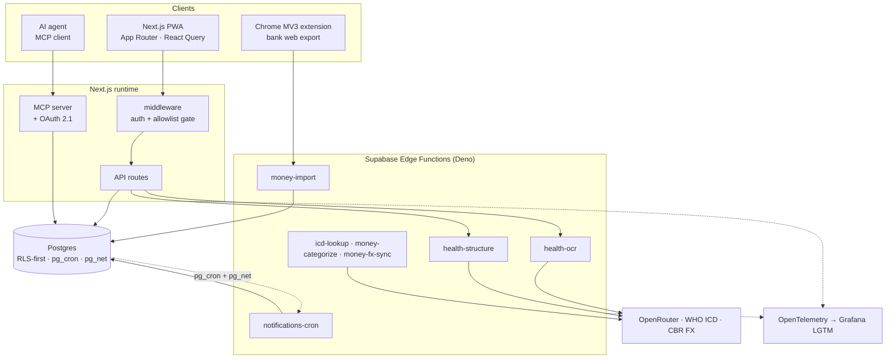
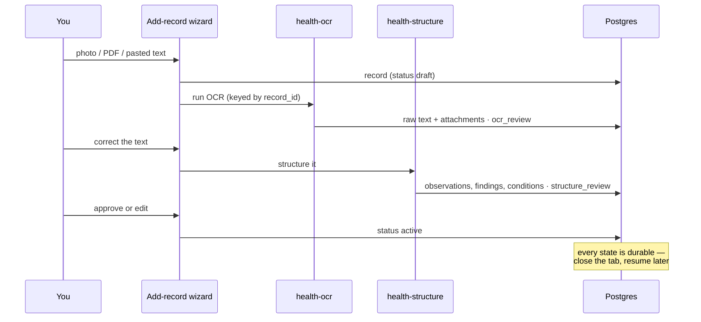

<div align="center">


# Orbit

**A self-hosted personal superapp for the two things that quietly run your life: your health and your money.**

Everything about you, your family, and your pets — in one place you actually own.

[](https://github.com/mpodreshetnikov/Orbit/actions/workflows/main.yml)
[](./LICENSE)
[](https://nextjs.org)
[](https://react.dev)
[](https://www.typescriptlang.org)
[](https://supabase.com)
[](./docs/design/domains/health/mcp-server.md)

</div>

---

## What is this?

Your medical history lives in a shoebox of PDF scans. Your spending lives in a bank app that will
happily forget it in two years. Neither talks to the other, and neither belongs to you.

Orbit is one Next.js app on top of Supabase that fixes that for a single household:

- **Photograph a lab report** → OCR + LLM extraction turn it into typed observations, findings and
  conditions you can chart over five years.
- **Import your bank statements** through your own browser, not a third-party aggregator that
  resells your transaction history.
- **Ask an agent about it** — the Health domain is exposed over the Model Context Protocol with a
  real OAuth 2.1 consent screen and scoped tokens.

> [!NOTE]
> This is a personal project, published so the architecture, docs, and agent workflows can be read
> and reused. It is designed to be run by its owner: access is gated by an explicit allowlist and
> there is no multi-tenant sign-up flow. Fork it, don't sign up for it.

---

## Highlights

### 🩺 Health

Medical records, lab observations, findings, conditions, medications, doses, body measurements and
recurring checkups — for every person **and pet** in the household.

- **Scan → structured data.** A record moves through an explicit, resumable state machine:
  `draft → ocr_processing → ocr_review → structuring → structure_review → active`. Every stage is
  reviewable, retryable and idempotent — a double-click or a lost connection never creates a
  duplicate record.
- **Longitudinal history.** Observations are normalized against a catalog, so "hemoglobin" from a
  2021 scan and a 2026 lab portal land on the same chart with the same units.
- **ICD lookup** against the WHO ICD API for real condition coding.
- **Medication regimens** that generate dose events, track inventory, and fire push reminders
  through `pg_cron` → `pg_net` → Edge Function → service worker.

### 💸 Money

Accounts, cards, transactions with line-item splits, categories with a canonical rule pipeline,
and an audit trail.

- **Your browser is the connector.** A Chrome MV3 extension logs into your bank _as you_, exports
  the data, and posts it to the `money-import` Edge Function. No credentials leave your machine and
  no aggregator sits in the middle.
- **Import sessions are inspectable** — batches, per-row status, and a debug harness
  (`just extension-debug-live`) that produces `diagnostics.json`, a human report and a CSV preview
  when a bank changes its DOM.
- **FX rates** synced from the central bank, so multi-currency totals are honest.

### 🤖 MCP connector

The Health domain speaks [MCP](https://modelcontextprotocol.io) — `get_medical_record`,
`get_observation_history`, `list_conditions`, `search_findings`, medication and checkup tools, and
their write counterparts.

- In-app **OAuth 2.1 authorization server** with a signed consent form.
- **Separate read and write scopes**, checked again at dispatch time — a read-only token cannot
  write even if the tool is called directly.
- **Off by default.** Without `MCP_SERVER_ENABLED=1`, every MCP and OAuth route returns 404.

### 📱 PWA

Installable, offline-aware, bilingual (EN/RU), with push notifications rendered and actioned by a
service worker.

---

## Architecture



Five layers, with dependency rules that are actually written down in
[`docs/ARCHITECTURE.md`](./docs/ARCHITECTURE.md):

| Layer                        | Lives in                                                      | Rule                                                  |
| ---------------------------- | ------------------------------------------------------------- | ----------------------------------------------------- |
| 1. Presentation              | `src/app`, `src/components`                                   | May not duplicate durable business rules              |
| 2. Application orchestration | `src/hooks`, `src/stores`                                     | Orchestrates calls; invariants belong below           |
| 3. Domain workflow logic     | `supabase/functions`, `supabase/db/functions`, triggers, cron | Never depends on component assumptions                |
| 4. Data governance           | `supabase/migrations`, `supabase/db/policies`                 | **Every user table has explicit RLS**                 |
| 5. Delivery & operations     | `.github/workflows`, `justfile`, `scripts/just`               | DB behavior changes migration + deploy track together |

### How a scan becomes data



Failures branch instead of dead-ending: OCR that returns garbage parks the record in `ocr_failed`
with the error attached and a retry path that reuses the same record. The full contract is in
[`docs/design/domains/health/records-ingestion-pipeline.md`](./docs/design/domains/health/records-ingestion-pipeline.md).

---

## Stack

| Surface           | Built with                                                          |
| ----------------- | ------------------------------------------------------------------- |
| Web app           | Next.js 15 (App Router), React 19, React Query, Tailwind, shadcn/ui |
| Database          | Supabase Postgres — RLS-first, `pg_cron`, `pg_net`, pgTAP tests     |
| Edge Functions    | Deno 2 — OCR, LLM structuring, import, categorization, cron         |
| Browser extension | Chrome MV3 + Vite, bank web-export connectors                       |
| AI                | OpenRouter (vision OCR + structured extraction), WHO ICD API        |
| Observability     | OpenTelemetry → Grafana LGTM (Loki, Tempo, Mimir)                   |
| Delivery          | GitHub Actions → Vercel + Supabase, gitleaks pre-push hook          |

---

## Getting started

**Prerequisites:** [`just`](https://github.com/casey/just), Node.js 22, Deno 2.x, the Supabase CLI, and Docker.

Bootstrapping is two-phase, because the keys you need in `.env.local` are printed by the local
Supabase stack once it is up:

```bash
just install-dependencies    # install dependencies
just git-hooks-install       # enable hooks, including the pre-push secret scan

just supabase-local-start    # phase 1 — bring up local Supabase
just supabase-local-status   # copy the API URL and anon key from this output
#                              into NEXT_PUBLIC_SUPABASE_URL / NEXT_PUBLIC_SUPABASE_ANON_KEY
#                              in a new .env.local

just dev                     # phase 2 — schema, seed, and the dev stack
```

`just dev` is long-running and holds the foreground; tear it down with `just dev stop`.

The full environment variable reference — including the MCP connector and observability toggles —
is in [`docs/SETUP.md`](./docs/SETUP.md).

### Everyday commands

```bash
just quality          # format, lint, typecheck — no builds, no DB, no tests
just test-unit        # all unit lanes (web, extension, node, Deno functions)
just test-e2e         # Playwright end-to-end flows
just quality-db-test  # pgTAP tests against the local database
just ci-verify-local  # the full local gate — static checks, builds, coverage, e2e
just obs-up           # local Grafana LGTM stack
```

`just --list --unsorted` is the source of truth for every command;
[`AGENTS.md`](./AGENTS.md) maps the canonical command IDs used in plans and PRs.

---

## The quality bar

These run on every push, and a failure blocks the merge:

- **Secrets scan first.** gitleaks runs as a pre-push git hook _and_ as the first CI job. A leaked
  key never reaches the remote.
- **Runtime-split unit lanes** — web (jsdom), extension, node scripts, and Deno Edge Functions each
  test in their real runtime instead of a lowest-common-denominator mock.
- **pgTAP tests and a DB lint** scoped to the `public` schema, where warnings fail.
- **Generated DB artifacts are verified, not trusted** — the schema snapshot and TypeScript types
  are regenerated in CI and drift fails the build.

Run on demand, deliberately kept out of the push path:

- **Extraction quality is scored** against a fixture corpus of real documents
  (`just test-extraction`, or the `Extraction Eval` workflow from the Actions tab). A live run calls
  a paid provider, so it is manual by design; the default replays committed recordings and costs
  nothing.

The quality operating model — which checks run at which stage, and the final gate before handoff —
is written down in [`docs/QUALITY.md`](./docs/QUALITY.md).

---

## Built with agents, on purpose

Orbit is developed largely by AI agents, and the repository is structured so that's a strength
rather than a liability:

- **[`AGENTS.md`](./AGENTS.md) is a map, not a bible** — canonical knowledge lives in `docs/`, and
  the map only points at it. One source of truth, no drift.
- **Docs are contracts.** [`docs/design/core-beliefs.md`](./docs/design/core-beliefs.md) states each
  belief with _why it exists_, _how it's enforced in this repo_, _failure signals_, and _corrective
  actions_ — the kind of thing an agent can actually check itself against.
- **Repo-local skills** in `.agents/skills`, mirrored into `.claude/skills` and pinned by
  `skills-lock.json` with content hashes. Vendored skills from upstream sources sit alongside
  project-specific ones (`supabase-db-workflow`, `chrome-extension-web-scraping`,
  `full-stack-traceability`, `relevant-quality-checks`) and a sync check runs inside `just quality`.
- **Full-stack traceability by default** — structured logs, OTLP traces and correlation IDs across
  frontend, API, Edge Functions and Postgres, so debugging a report is reading a trace rather than
  guessing.

---

## Repository layout

```
src/                    Next.js app — routes, components, hooks, stores, MCP tools
supabase/
  migrations/           migration history (67 and counting)
  db/                   idempotent deploy track: functions, policies, triggers, cron, pgTAP
  functions/            Deno Edge Functions
browserExtension/       Chrome MV3 extension and bank connectors
shared/                 code shared between app and extension
docs/                   architecture, design, quality, security, runbook
.agents/skills/         repo-local agent skills (mirrored to .claude/skills)
scripts/just/           command implementations behind the justfile
observability/          local Grafana LGTM configuration
```

---

## Documentation

| Document                                                                                 | Contents                                                          |
| ---------------------------------------------------------------------------------------- | ----------------------------------------------------------------- |
| [`docs/ARCHITECTURE.md`](./docs/ARCHITECTURE.md)                                         | Runtime surfaces, domain and layer boundaries, maturity scorecard |
| [`docs/DESIGN.md`](./docs/DESIGN.md)                                                     | Design patterns, anti-patterns, deep design map                   |
| [`docs/design/core-beliefs.md`](./docs/design/core-beliefs.md)                           | The principles the codebase is held to                            |
| [`docs/SETUP.md`](./docs/SETUP.md)                                                       | Local setup and environment variables                             |
| [`docs/QUALITY.md`](./docs/QUALITY.md)                                                   | Quality gates and scoring model                                   |
| [`docs/SECURITY.md`](./docs/SECURITY.md)                                                 | Access model, RLS expectations, secret handling                   |
| [`docs/RUNBOOK.md`](./docs/RUNBOOK.md)                                                   | Operations and debugging procedures                               |
| [`docs/design/domains/health/mcp-server.md`](./docs/design/domains/health/mcp-server.md) | MCP tool surface, OAuth flow, client setup                        |
| [`mcp/README.md`](./mcp/README.md)                                                       | MCP server configuration and IDE sync                             |

---

## Security

Access is allowlist-gated via `public.allowed_users`, enforced in middleware and backed by
row-level security on every data table — `is_allowed_user()` and ownership checks are applied in
SQL, so any caller holding a user token gets the same answer whether it arrives through the web
app, an API route, the extension or an MCP tool.

Two trust boundaries, and it matters which one you are reading:

- **User-scoped paths** are governed by RLS. The policy is the enforcement.
- **Service-role paths** — cron routes and several Edge Functions that must act outside a user
  session — deliberately hold a key that **bypasses RLS**, and are responsible for their own bearer
  token, caller, and ownership validation. RLS does not protect them for free. If you fork this,
  audit those paths yourself rather than assuming the policies cover them.

Service-role credentials are confined to server contexts and never reach a client bundle.

Found a security issue? Please open an issue **without** sensitive details, and see
[`docs/SECURITY.md`](./docs/SECURITY.md) for the security model.

---

## License

[MIT](./LICENSE) © Maxim Podreshetnikov
